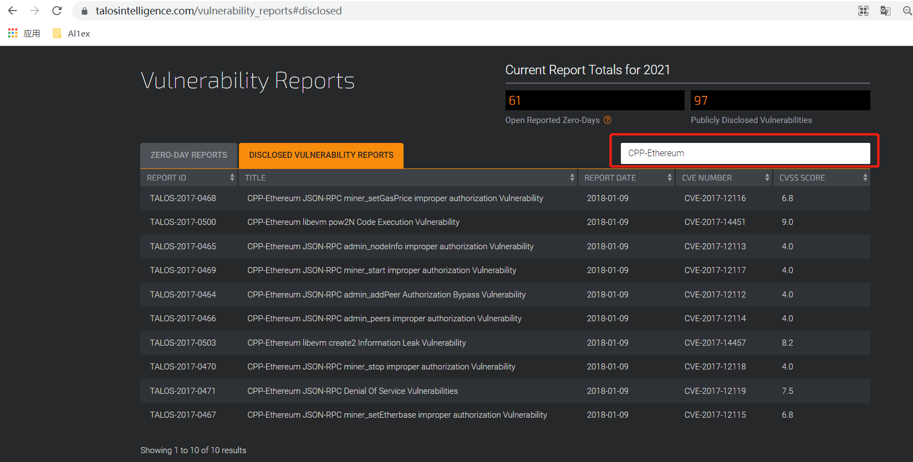

## 共识攻击

[详谈共识攻击(一)](https://bcsec.org/index/detail/tag/2/id/342)

[详谈共识攻击(二)](https://bcsec.org/index/detail/tag/2/id/350)

[详谈共识攻击(三)](https://bcsec.org/index/detail/tag/2/id/376)

[详谈共识攻击(四)](https://bcsec.org/index/detail/tag/2/id/381)

## 漏洞示例

[Unitus公链拒绝服务和双花漏洞](https://blog.csdn.net/Fly_hps/article/details/86066683)

[比特币首个远程DoS漏洞详解](https://blog.csdn.net/Fly_hps/article/details/86013638)

[亦来云多个远程DoS漏洞详解](https://blog.csdn.net/Fly_hps/article/details/86012011)

[IOST公链P2P远程拒绝服务漏洞](https://bcsec.org/index/detail/tag/2/id/545)

[来自P2P协议的异形攻击漏洞](https://bcsec.org/index/detail/tag/2/id/547)

[区块链底层系统漏洞类型之-双生树漏洞](https://mp.weixin.qq.com/s/A_o3As2W3NJJ3LKug4WeCg)

[以太坊DNS重绑攻击](https://github.com/ethereum/go-ethereum/pull/15962)

[DPOS漏洞浅析]

[某公链UI鉴权逻辑缺陷]

[Filecoin双花攻击](https://mp.weixin.qq.com/s/iZ90ZsyaYOcpEFixzMMJYg)

......

**PS:由于部分信息过于敏感，而且目前有部分公链未修复相关类型漏洞，遂决定暂不公开相关漏洞详情，具体详情将在2022年7月份左右全面公开**

## 漏洞仓库

[CVE-list](https://en.bitcoin.it/wiki/Common_Vulnerabilities_and_Exposures)

[talosintelligence](https://talosintelligence.com/vulnerability_reports#disclosed)

**Al1ex's CNVD list**

- CNVD-2020-30134 BlockChain Underlying network
- CNVD-2020-55003 Sinoc
- CNVD-2020-55001 Sinoc
- CNVD-2020-64701 Iotus
- CNVD-2020-64702 filecoin
- CNVD-2021-02089 filecoin
- CNVD-2021-02089 filecoin
- CNVD-2021-16002 KadiCoin
- CNVD-2021-16845 oilbtc
- CNVD-2021-16844 achievecoin
- CNVD-2021-18261 QbaoChain
- CNVD-2021-17272 ravecoin

**Al1ex's CVE List**

- CVE-2020-20546 Elastos ELA
- CVE-2020-20558 Elastos ELA
- CVE-2020-20559 Bytom vapor
- CVE-2020-20560 Bytom bytom

## 安全思考

### 数据层

- 区块时间戳

- MerkleTree构建

### 网络层

- P2P网络

- 区块传播机制

- 区块验证机制

### 共识层

- 共识算法设计
- .......

### 激励层

- 激励机制设计
- .......

### 合约层

- 合约部署
- 合约调用
- 合约运行
- ......

### 应用层

- 钱包UI
- RPC接口鉴权
- RPC数据处理
- 密码安全策略

### 其他类

- 中间件安全
- 节点运行环境
- 节点安全配置
- 开发语言特性
- .......

