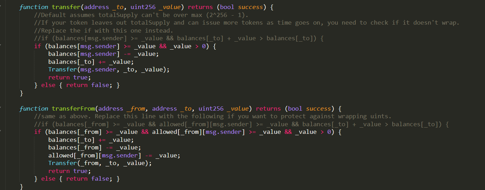
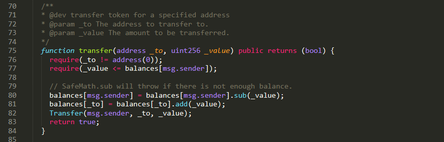
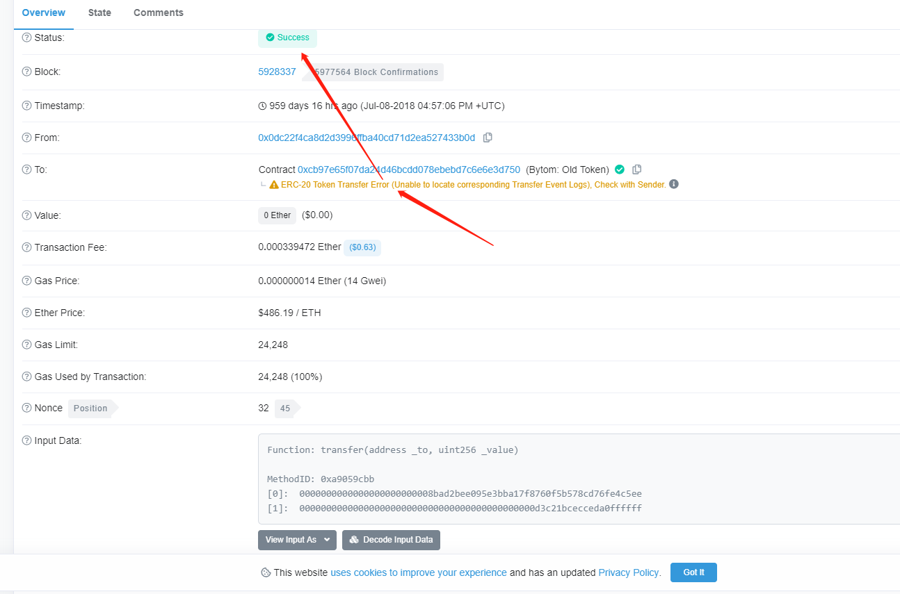
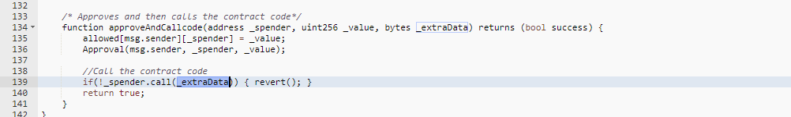

#### 文章前言

以太坊代币“假充值”漏洞影响面非常之广，影响对象至少包括：相关中心化交易所、中心化钱包、代币合约等

#### 漏洞细节 

以太坊代币交易回执中status字段是0x1(true)还是 0x0(false)，取决于交易事务执行过程中是否抛出了异常(比如使用了 require/assert/revert/throw等机制)，当用户调用代币合约的transfer函数进行转账时，如果transfer函数正常运行未抛出异常，该交易的 status即是0x1(true)



如图代码，某些代币合约的 transfer 函数对转账发起人(msg.sender)的余额检查用的是 if 判断方式，当 balances[msg.sender] < _value 时进入else逻辑部分并return false，最终没有抛出异常，我们认为仅if/else这种温和的判断方式在transfer这类敏感函数场景中是一种不严谨的编码方式，而大多数代币合约的transfer函数会采用 require/assert 方式，当不满足条件时会直接抛出异常，中断合约后续指令的执行：



我们很难要求所有程序员都能写出最佳安全实践的代码，这种不严谨的编码方式是一种安全缺陷，这种安全缺陷可能会导致特殊场景下的安全问题，攻击者可以利用存在该缺陷的代币合约向中心化交易所、钱包等服务平台发起充值操作，如果交易所仅判断如 TxReceipt Status是success(即上文提的status为0x1(true)的情况)就以为充币成功，就可能存在"假充值"漏洞~

参考示例 TX：https://etherscan.io/tx/0x9fbeeba6c7c20f81938d124af79d27ea8e8566b5e937578ac25fb6c68049f92e



#### 漏洞实例

下面以Redex去中心化交易ERC223代币假充值为例做简单介绍：

官网：https://radex.ai/ 

Redex去中心化交易所搭建在以太坊上面，合约地址如下：

https://cn.etherscan.com/address/0x9462eeb9124c99731cc7617348b3937a8f00b11f#code 

缺陷函数为tokenFallback函数：

```javascript
 function tokenFallback(address _from, uint _value, bytes /* _data */) {
    // ERC223 token deposit handler
        balances[_from][msg.sender] = balances[_from][msg.sender].add(_value);
        Deposit(msg.sender, _from, _value, now);
  }
```

此函数是用于ERC223代币在对Radex交易所转账后执行回调操作的，当接收到用户的ERC223代币，Radex交易所就会在自己的体系里面给用户标记上其所拥有代币资产，但是在这个tokenFallback函数没有经过任何验证，在接收到ERC223代币的请求后就直接给用户标记资产了，这里会有几点安全问题：

- 代币自己作恶，如果代币自己向此合约恶意调用tokenFallback方法的话，那么此交易所就会凭空标记无数代币资产 
- 代币代码缺陷，如果代币存在相关漏洞，可以使代币向此合约的tokenFallback函数发起请求的话，也会造成此交易所凭空标记无数代币资产，而并没有受到任何代币。

以第二点为例： 

先找一个存在call注入漏洞的代币

https://cn.etherscan.com/address/0x5a9bf6badcd24fe0d58e1087290c2fe2c728736a#code 



这里找到了一个名为18T的代币在approveAndCallcode函数中存在call注入漏洞，此代币已经上过其他很多交易所，此时攻击者只需要调用此代币的approveAndCallcode函数，并把_spender参数设置为Radex交易所的地址，然后在_extraData中填充函数名(tokenFallback)、参数(充值地址、充值数量)等信息就可以在此交易所给自己充值无数的18T代币，但交易所实际上没收到任何18T代币，不过这个缺陷危害有限，主要因为以下两点：

- 需要有存在call注入漏洞的代币来配合完成 
- 就算配合代币完成了假充值，在该去中心化交易所的官网上也不一定会上该币，合约中是存在，但是网站上是看不到的。

#### 修复方案 

除了判断交易事务success之外，还应二次判断充值钱包地址的balance是否准确的增加，其实这个二次判断可以通过Event事件日志来进行，很多中心化交易所、钱包等服务平台会通过Event事件日志来获取转账额度，以此判断转账的准确性，但这里就需要特别注意合约作恶情况，因为Event是可以任意编写的，不是强制默认不可篡改的选项：

```javascript
emit Transfer(from, to, value); // value 等参数可以任意定义
```

作为平台方，在对接新上线的代币合约之前，应该做好严格的安全审计，这种安全审计必须强制代币合约方执行最佳安全实践。  作为代币合约方，在编码上，应该严格执行最佳安全实践，并请第三方职业安全审计机构完成严谨完备的安全审计。