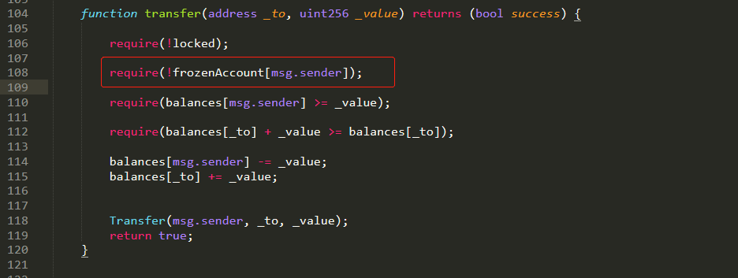
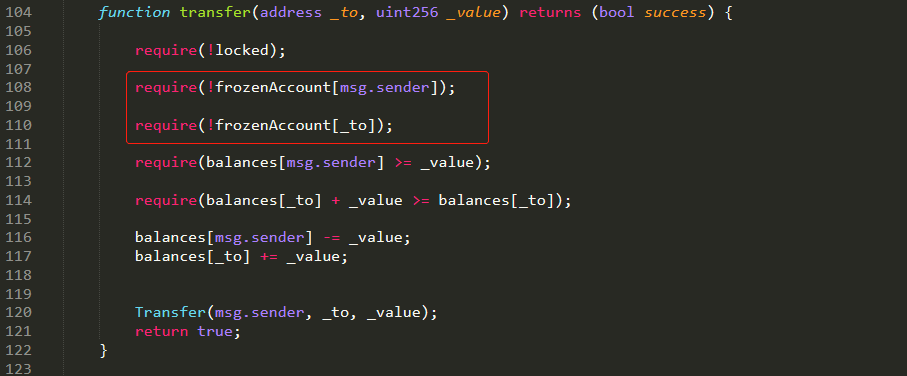

#### 漏洞概述

在一些智能合约中会存在freezen()函数，用于冻结账户，而“冻结账户绕过”该漏洞就触发在“转移代币”时，合约未校验来源账户、发起账户、目标账户是否被冻结而导致的。

#### 漏洞实例

如下所示，在智能合约转移代币时只校验了发起账户是否处于冻结状态，而未校验目标账户是否处于被冻结状态：

该漏洞导致的安全危害是向冻结的账号转账后冻结的账号资产无法转出。

#### 防御措施

增加对资产接收地址账户的冻结状态的检查，例如：

